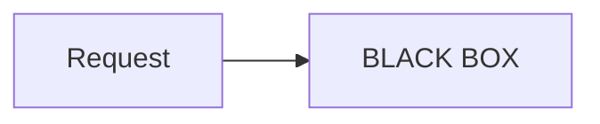

# Problems Found During Session 1 Development

This document captures issues discovered while building and testing the Session 1 Observability workshop. Reference this to avoid repeating mistakes.

---

## Issue 1: Python String Template Double Braces

**Symptom:** `KeyError: 'query'` or `KeyError: 'tool'` when calling `.format()` on prompts

**Root Cause:** When using Python's `.format()` method, literal curly braces in the string (like JSON examples) must be escaped with double braces `{{` and `}}`. The parts of the string outside curly braces are treated literally, except that any doubled curly braces `'{{'` or `'}}'` are replaced with the corresponding single curly brace.

**Broken Code:**
```python
TOOL_PLANNING_PROMPT = """...
Args: {"query": "search terms"}
[{"tool": "name", "args": {...}}, ...]
User question: {query}"""

prompt.format(query="Who owns billing?")  # KeyError!
```

**Fixed Code:**
```python
TOOL_PLANNING_PROMPT = """...
Args: {{"query": "search terms"}}
[{{"tool": "name", "args": {{...}}}}, ...]
User question: {query}"""

prompt.format(query="Who owns billing?")  # Works!
```

**Rule:** Any `{` or `}` that is NOT a format variable must be doubled. Backslash `\` cannot be used to escape curly braces.

**References:**
- [AskPython - Escape Curly Braces](https://www.askpython.com/python/string/escape-curly-braces-string)
- [Python Docs - String Formatting](https://docs.python.org/3.3/library/string.html)
- [Delft Stack - Format Escape Curly Braces](https://www.delftstack.com/howto/python/python-format-escape-curly-braces/)

---

## Issue 2: Mermaid Code Blocks Don't Render in Google Colab

**Symptom:** Raw mermaid code shows as text instead of diagram in Colab notebooks

**Root Cause:** Google Colab does **not** natively render Mermaid diagrams in markdown cells using the standard ` ```mermaid ` syntax. This only works in:
- GitHub README rendering
- Jupyter with mermaid extensions
- VS Code with mermaid plugins

**Broken (in Colab):**
```markdown
## The Black Box Problem


```

**Workaround Options:**

1. **Pre-render to SVG** (recommended for workshops):
```markdown

```

2. **Use mermaid.ink API in Python cell:**
```python
import base64
from IPython.display import Image, display

def mm(graph):
    graphbytes = graph.encode("ascii")
    base64_bytes = base64.b64encode(graphbytes)
    base64_string = base64_bytes.decode("ascii")
    display(Image(url="https://mermaid.ink/img/" + base64_string))

mm("""
flowchart LR;
    A--> B & C & D;
""")
```

3. **Use MermaidGen-Colab-Jupyter** for high-quality SVG via kroki.io

**Rule:** Always pre-render mermaid diagrams to SVG for Colab compatibility.

**References:**
- [MermaidGen-Colab-Jupyter](https://github.com/FelixLeChat92/MermaidGen-Colab-Jupyter)
- [Google Colab Markdown Guide](https://colab.research.google.com/notebooks/markdown_guide.ipynb)

---

## Issue 3: SVG Width="100%" Makes Diagrams Gigantic

**Symptom:** SVG diagrams fill entire container width, making them huge with tiny text

**Root Cause:** Mermaid CLI (`mmdc`) generates SVGs with `width="100%"` by default. The SVG document includes a calculated `max-width` in the style, but `width="100%"` causes it to scale to container.

**Known Issue:** [mermaid-cli #816](https://github.com/mermaid-js/mermaid-cli/issues/816) - Flowcharts can be very wide, and there's no `--maxwidth` flag yet.

**Broken SVG:**
```xml
<svg width="100%" style="max-width: 523.797px;" viewBox="0 0 523 1510" ...>
```

**Fixed SVG:**
```xml
<svg width="523px" style="max-width: 523.797px;" viewBox="0 0 523 1510" ...>
```

**Fix Options:**

1. **Post-process with sed:**
```bash
# After generating with mmdc, fix the width
sed -i '' 's/width="100%"/width="700px"/' diagram.svg
```

2. **Extract max-width and use it:**
```bash
# Get max-width from SVG and set as width
max_width=$(grep -o 'max-width: [0-9.]*px' diagram.svg | head -1 | grep -o '[0-9.]*')
sed -i '' "s/width=\"100%\"/width=\"${max_width}px\"/" diagram.svg
```

3. **Use CSS file with mmdc:**
```bash
mmdc -i input.mmd -o output.svg --cssFile custom.css
```

**Rule:** Post-process SVGs to replace `width="100%"` with fixed pixel width (500-800px typical).

**References:**
- [mermaid-cli GitHub](https://github.com/mermaid-js/mermaid-cli)
- [mermaid-cli Issue #816 - Width options](https://github.com/mermaid-js/mermaid-cli/issues/816)
- [mermaid.cli Issue #3 - Width/height options](https://github.com/mermaidjs/mermaid.cli/issues/3)

---

## Issue 4: OpenTelemetry TracerProvider Can Only Be Set Once

**Symptom:** Warning "Overriding of current TracerProvider is not allowed" when re-running notebook cells

**Root Cause:** OpenTelemetry's `set_tracer_provider()` can only be called once per Python process. This is by design in the OpenTelemetry specification - the prevention of overriding is intentional to avoid inconsistent state. In notebooks where cells are re-run, this causes issues.

**Broken (fails on re-run):**
```python
# Cell 1 - runs fine first time, warns on re-run
provider = TracerProvider(resource=resource)
trace.set_tracer_provider(provider)
```

**Fixed (idempotent):**
```python
from opentelemetry import trace
from opentelemetry.sdk.trace import TracerProvider

# Check if already configured
current_provider = trace.get_tracer_provider()
if current_provider.__class__.__name__ == "ProxyTracerProvider":
    # Not yet configured, safe to set
    provider = TracerProvider(resource=resource)
    exporter = OTLPSpanExporter(endpoint=JAEGER_ENDPOINT, insecure=True)
    provider.add_span_processor(BatchSpanProcessor(exporter))
    trace.set_tracer_provider(provider)
    print("TracerProvider configured!")
else:
    print("TracerProvider already configured, skipping...")

# Always get tracer from current provider
tracer = trace.get_tracer("devhub")
```

**Alternative - Restart Runtime:**
In Colab, users can go to Runtime → Restart runtime to reset the Python process.

**Workshop Instruction:** Add note in notebook:
> **Note:** If you need to re-run this cell after changes, restart the runtime first (Runtime → Restart runtime) to reset the TracerProvider.

**References:**
- [OpenTelemetry Python Issue #3743 - Streamlit + OTel](https://github.com/open-telemetry/opentelemetry-python/issues/3743)
- [OpenTelemetry Spec Issue #3302 - Allow resetting provider](https://github.com/open-telemetry/opentelemetry-specification/issues/3302)
- [OpenTelemetry Python Issue #1159 - DefaultTracerProvider](https://github.com/open-telemetry/opentelemetry-python/issues/1159)

---

## Issue 5: SVG Files Referenced Before Push to GitHub

**Symptom:** Notebook shows broken images because SVGs reference GitHub raw URLs

**Root Cause:** Notebook markdown cells use URLs like:
```
https://raw.githubusercontent.com/axel-sirota/salesforce-ai-workshops/main/exercises/session_01/charts/01_five_layer_architecture.svg
```

If SVGs are modified locally but not pushed, the notebook still fetches old/broken versions from GitHub.

**Rule:** After modifying any SVG, always:
1. Commit changes
2. Push to GitHub
3. Wait ~1-2 min for raw.githubusercontent.com cache to update
4. Hard refresh browser (Ctrl+Shift+R) to clear local cache

---

## Issue 6: Notebook Cell Editing Mistakes - Wrong Cell Modified

**Symptom:** SVG image reference ended up in wrong cell, or edits applied to wrong location

**Root Cause:** When programmatically editing Jupyter notebooks (JSON structure), it's easy to:
- Target wrong cell index
- Match wrong pattern that exists in multiple cells
- Lose track of cell positions after insertions/deletions

**Prevention:**

1. **Always verify cell content before editing:**
```python
# Print cell content to verify it's the right one
print(f"Cell {i}: {source[:100]}...")
```

2. **Use unique identifiers in search patterns:**
```python
# Bad - might match multiple cells
if 'BLACK BOX' in source:

# Good - more specific
if '## The Black Box Problem' in source and '```mermaid' in source:
```

3. **After editing, verify the change:**
```python
# Re-read and confirm
with open(notebook_path, 'r') as f:
    nb = json.load(f)
print(nb['cells'][target_cell]['source'])
```

4. **Use cell IDs if available** (Jupyter 4.5+):
```python
# Some notebooks have cell IDs
cell_id = cell.get('id', None)
```

**Rule:** When editing notebooks programmatically:
- Print before/after to verify
- Use specific patterns that won't match multiple cells
- Test in a copy first

---

## Issue 7: Notebook JSON Structure Gotchas

**Symptom:** Edits don't appear, or notebook won't open after editing

**Root Cause:** Jupyter notebook JSON has specific requirements:
- `source` can be string OR list of strings
- Newlines must be explicit `\n` in strings
- Metadata must be preserved

**Safe Editing Pattern:**
```python
import json

with open('notebook.ipynb', 'r') as f:
    nb = json.load(f)

for cell in nb['cells']:
    # Handle both string and list formats
    source = cell['source']
    if isinstance(source, list):
        source = ''.join(source)

    # Make edits to source string
    if 'PATTERN' in source:
        source = source.replace('OLD', 'NEW')
        cell['source'] = source  # Save back as string (works fine)

# Write with indent for readability
with open('notebook.ipynb', 'w') as f:
    json.dump(nb, f, indent=1)
```

**Rule:** Always handle `source` as potentially being a list, and test notebook opens correctly after editing.

---

## Issue 8: SVG References Must Use Absolute GitHub URLs

**Symptom:** Broken images when notebook is hosted (Google Colab, nbviewer) — relative paths like `charts/XX.svg` don't resolve.

**Root Cause:** Notebooks are served from hosted platforms that don't have access to the local file tree. Relative paths like `` only work when running the notebook locally from the same directory.

**Broken (in hosted notebooks):**

```markdown

```

**Fixed:**

```markdown

```

**Pattern:**

```text
https://raw.githubusercontent.com/axel-sirota/salesforce-ai-workshops/main/exercises/session_XX/charts/YY_name.svg
```

**Rule:** All SVG image references in notebooks MUST use absolute GitHub raw URLs, not relative paths. This applies to both exercise and solution notebooks. After pushing SVGs, wait ~1-2 min for raw.githubusercontent.com cache to update.

---

## Summary Checklist for Future Sessions

- [ ] Escape JSON examples in prompts with double braces `{{}}`
- [ ] Pre-render mermaid to SVG (no inline mermaid in Colab)
- [ ] Fix SVG `width="100%"` to fixed pixels after mmdc generation
- [ ] Make TracerProvider setup idempotent (check before setting)
- [ ] Push SVGs to GitHub before testing notebook image rendering
- [ ] When editing notebooks programmatically, verify correct cell targeted
- [ ] Test full notebook in fresh Colab runtime before release
- [ ] Handle notebook source as string OR list
- [ ] Use absolute GitHub raw URLs for all SVG references (not relative `charts/` paths)
